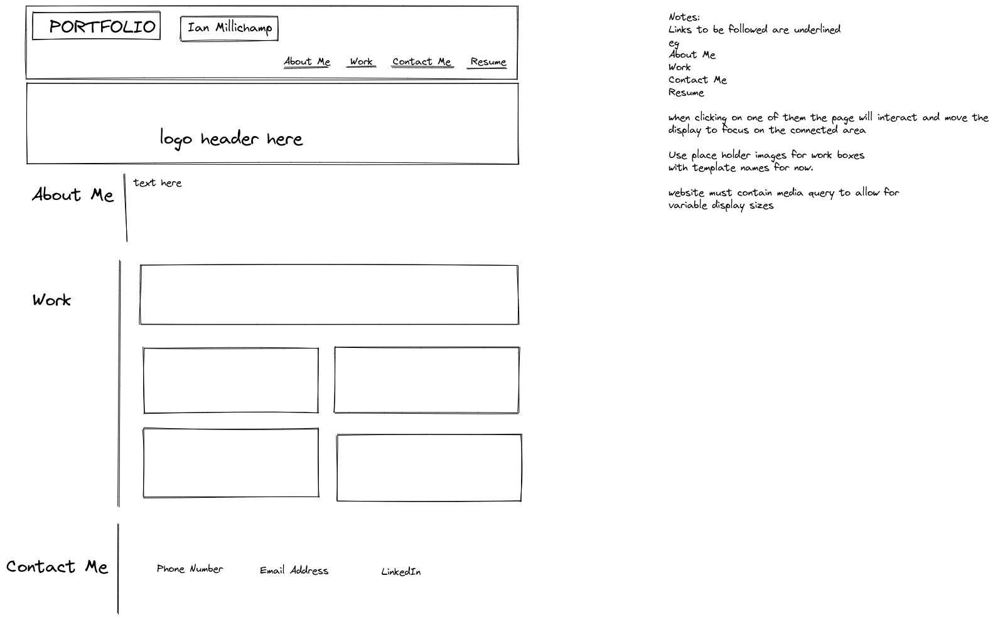

## Portfolio

Portfolio Website for Student 

## Description 

Project is the creation of a portfolio website to display work created by the student. Website is to be adaptable to multiple display sizes and properly laid out using flex and grid.

## link to deployed website

https://writers855.github.io/PortfolioIM/


## Development

steps taken to develop website

First step was to wireframe website

```


## Credits

Main developer - Ian Millichamp

credit to be given to the following sources for assistence in the development of this website

Student Andrea - during working hours gave helpful advice that helped resolve initial problems with grid layout and understanding when and when not to use it.

week 2 lesson 2 examples

use of gap command - folkstalk.com
how to stretch background images - thoughtco.com
resolved issue with class usage - learnt about main tag - video from office hours December 2nd 2022
box alignment in grid layout - mdn
Tutorial session 9th December 2022 - David Elutilo


## License

MIT License

Copyright (c) 2022 Writers855

Permission is hereby granted, free of charge, to any person obtaining a copy
of this software and associated documentation files (the "Software"), to deal
in the Software without restriction, including without limitation the rights
to use, copy, modify, merge, publish, distribute, sublicense, and/or sell
copies of the Software, and to permit persons to whom the Software is
furnished to do so, subject to the following conditions:

The above copyright notice and this permission notice shall be included in all
copies or substantial portions of the Software.

THE SOFTWARE IS PROVIDED "AS IS", WITHOUT WARRANTY OF ANY KIND, EXPRESS OR
IMPLIED, INCLUDING BUT NOT LIMITED TO THE WARRANTIES OF MERCHANTABILITY,
FITNESS FOR A PARTICULAR PURPOSE AND NONINFRINGEMENT. IN NO EVENT SHALL THE
AUTHORS OR COPYRIGHT HOLDERS BE LIABLE FOR ANY CLAIM, DAMAGES OR OTHER
LIABILITY, WHETHER IN AN ACTION OF CONTRACT, TORT OR OTHERWISE, ARISING FROM,
OUT OF OR IN CONNECTION WITH THE SOFTWARE OR THE USE OR OTHER DEALINGS IN THE
SOFTWARE.


